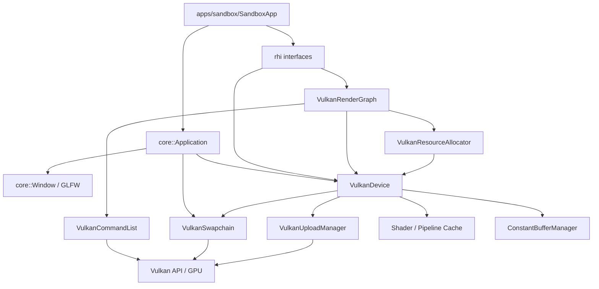
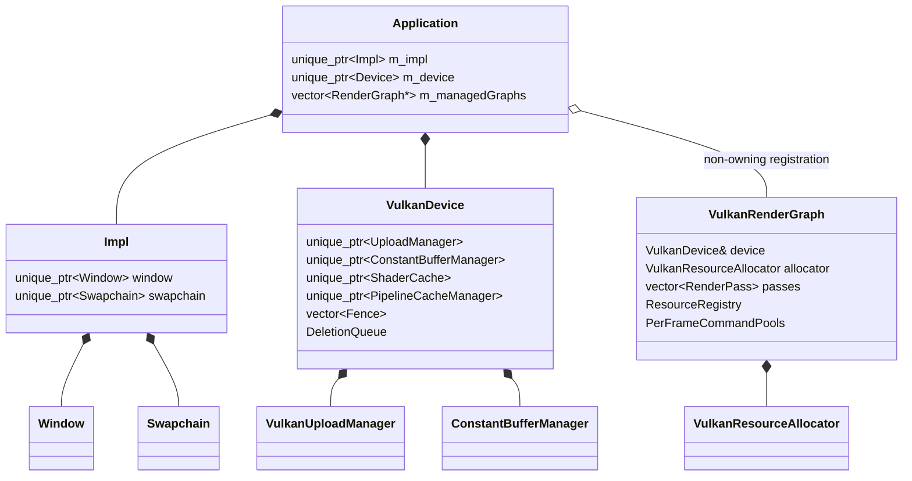
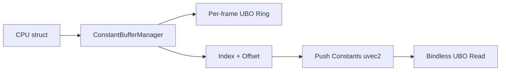
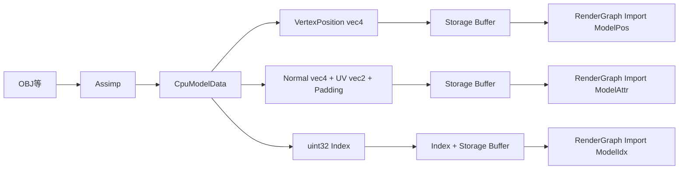

# MyRenderer Architecture

> 生成元: `MyRenderer-source.zip` のソーススナップショット  
> 作成日: 2026-08-05  
> 対象: 現行Vulkanバックエンド、Sandbox、RenderGraph、Asset Upload、BVH Ray Tracing

## 1. 文書の目的と情報の扱い

この文書は、MyRendererの内部実装をソースコードに基づいて整理したものである。

設計意図だけでなく、現在の呼び出し順、所有関係、同期方式、データの流れ、実装上の前提を記録する。READMEと実装が異なる場合は現行コードを優先する。

簡潔な共有用情報は`Context.md`を参照する。

---

## 2. 全体構成



大きく次の4層に分かれる。

### Application層

- `apps/sandbox/main.cpp`
- `core::Application`
- `core::Window`
- Asset Utility

アプリケーション進行、Window、フレーム開始終了、RenderGraphの構築、シーンデータ更新を担当する。

### RHI層

- `rhi::Device`
- `rhi::Resource`
- `rhi::Buffer`
- `rhi::Image`
- `rhi::RenderGraph`
- `rhi::CommandList`
- `rhi::Swapchain`
- `rhi::UploadManager`
- `rhi::GPUProfiler`

Vulkan型を可能な範囲で隠し、レンダリング機能の共通インターフェースを提供する。

### Vulkan実装層

- `VulkanDevice`
- `VulkanRenderGraph`
- `VulkanBuffer`
- `VulkanImage`
- `VulkanCommandList`
- `VulkanSwapchain`
- `VulkanUploadManager`
- `VulkanResourceAllocator`
- Pipeline、Cache、Reflection、Profiler

RHIインターフェースをVulkan 1.3で実装する。

### Shader層

- GLSL 4.50 / 4.60
- shadercによるランタイムSPIR-Vコンパイル
- SPIRV-CrossによるReflection
- Global Bindless Descriptor Set
- Push ConstantsによるIndex受け渡し

---

## 3. ビルド構造

ルート`CMakeLists.txt`はC++20を指定し、`core`と`apps`をSubdirectoryとして追加する。

`RendererCore`はOBJECT Libraryであり、`core/src`以下の`.cpp`と`.c`を`GLOB_RECURSE`で収集する。`SandboxApp`が`RendererCore`へリンクする。

主な依存関係:

| 依存 | 使用箇所 |
|---|---|
| Vulkan | API本体 |
| GLFW | Window、Surface、イベント、時刻 |
| VMA | Buffer / Imageメモリ管理 |
| GLM | CPUデータ型、BVH、Camera |
| shaderc | GLSL→SPIR-V |
| SPIRV-Cross | Push Constant / Output / Local Size Reflection |
| Assimp | 3Dモデル読み込み |
| stb | Image Import / Export |
| lodepng | CMake依存に含まれるが現行Exporterはstb_image_writeを使用 |

RHIバックエンド選択は`RHIconfig.hpp`の`RHI_USE_VULKAN`マクロで行われる。`rhi::createDevice(GraphicsAPI::Vulkan)`は`VulkanDevice`を返す。DX12列挙値はあるが未実装である。

---

## 4. 所有関係と寿命



### Application

`Application`は以下を所有する。

- Pimpl内の`Window`
- Pimpl内の`Swapchain`
- `Device`

`m_managedGraphs`は生ポインタの非所有リストである。Resize時に各Graphへ`resize()`を呼ぶために使われる。

Graphの寿命がApplicationより短く、Graph破棄後もフレーム処理を継続する場合は`unregisterRenderGraph()`が必要である。

### Device

`VulkanDevice`は以下を所有する。

- Vulkan Instance / Physical Device / Logical Device
- Queue Handles
- VMA Allocator
- Global Bindless Descriptor Pool / Layout / Set
- Dummy Resource
- Timeline Semaphore 3系統
- Frames in Flight Fence
- UploadManager
- ConstantBufferManager
- Shader Cache
- Pipeline Cache Manager
- Vulkan Pipeline Cache
- Deferred Deletion Queue

### RenderGraph

`VulkanRenderGraph`は以下を所有する。

- Logical Pass
- Resource Registry
- Resource Lifetime
- Batch / Scope / Virtual Barrier
- `VulkanResourceAllocator`
- Frames in FlightごとのQueue別Command Pool
- CommandListキャッシュ

ImportされたResourceは所有しない。Graph内生成Resourceの物理実体は`VulkanResourceAllocator`のPoolが所有する。

---

## 5. Application初期化

`Application::Application`の順序:

```text
1. Implを生成
2. Windowを生成
3. Window Resize Callbackを設定
4. rhi::createDevice(Vulkan)を呼ぶ
5. Device::initialize(VulkanProvider)
6. SwapchainConfigを作る
7. Device::createSwapchain()
8. Delta Time基準時刻を保存
```

Swapchainの現在設定:

```text
enableLowLatency      = true
desiredBufferCount    = 3
enableComputePresent  = true
```

したがってSandboxは、可能ならMAILBOX、3 Image、Storage Usage付きSwapchainを要求する。

### Application破棄

```text
Device WaitIdle
  ↓
Swapchain破棄
  ↓
Device破棄
  ↓
Window破棄
  ↓
Impl破棄
```

SurfaceはSwapchainが所有し、Swapchain破棄時に破棄される。

---

## 6. VulkanDevice初期化

`VulkanDevice::initialize`の順序:

```text
1. VulkanProviderを保存
2. Vulkan Instanceを生成
3. Debug Messengerを生成
4. Physical Deviceを選択
5. Uniform Buffer Alignmentを取得
6. Logical Deviceを生成
7. Queue別Timeline Semaphoreを生成
8. VMA Allocatorを生成
9. Disk Pipeline Cacheを読み込み、VkPipelineCacheを生成
10. Global Bindless Descriptorを生成
11. Bindless破棄安全化用Dummy Resourceを生成
12. Shader Cacheを生成
13. Pipeline Cache Managerを生成
14. ConstantBufferManagerを生成
15. UploadManagerを生成
16. Frames in Flight Fenceを生成
```

### 有効化される主な機能

- Vulkan API 1.3
- Timeline Semaphore
- Synchronization2
- Dynamic Rendering
- Extended Dynamic State 1 / 2 / 3
- Descriptor Indexing
- Runtime Descriptor Array
- Partially Bound
- Update After Bind
- Variable Descriptor Count
- Storage / Uniform / Sampled ResourceのNon-uniform Indexing
- Multi Draw Indirect

### Physical Device選択

現行コードは、Graphics Queueを持つことよりもDedicated Compute Queueを持つことを選択条件としている。

```text
Compute対応 かつ Graphics非対応のQueue Familyを探す
  ↓
見つかった最初のPhysical Deviceを選択
  ↓
Graphics Queue Familyもあれば保存
```

Surface Present Support、Device Extension Support、要求Feature SupportをPhysical Device選択時に事前評価する処理はない。

### Queueの実態

RHI上は次の3種がある。

- Graphics
- Compute
- Transfer

現行`VulkanDevice::getQueue()`と`getQueueFamilyIndex()`は次のように動作する。

```text
Graphics → Graphics Queue / Family
Compute  → Compute Queue / Family
Transfer → Compute Queue / Family
```

`m_transferQueue`と`m_transferQueueFamilyIndex`はメンバとして存在するが設定されず、`findTransferQueueFamilyIndex`は宣言だけである。

したがって、Transfer PassとUploadManagerは論理上Transferだが、実際にはCompute QueueへSubmitされる。

---

## 7. Frame管理

`MAX_FRAMES_IN_FLIGHT`は3である。

`VulkanDevice::getCurrentFrame()`は0〜2のSlot Indexではなく、単調増加する`m_frameCounter`を返す。Slot選択時に`% MAX_FRAMES_IN_FLIGHT`を使う。

### beginFrame

```text
現在SlotのFenceをWait
  ↓
FenceをReset
  ↓
UploadManager::beginFrame(frameCounter)
  ↓
Deferred Deletion Queueを処理
  ↓
ConstantBufferManager::nextFrame()
  ↓
保留Descriptor UpdateをFlush
```

### endFrame

`m_frameCounter`を1増やすだけである。

Frame FenceはRenderGraphが最後のBatchをSubmitするときにSignal対象として付ける。

### Deferred Deletion

Resource破棄要求は、現在Frameから`MAX_FRAMES_IN_FLIGHT`後をTargetとしてQueueへ入る。

```cpp
targetFrame = currentFrame + MAX_FRAMES_IN_FLIGHT;
```

次回以降の`beginFrame`でTargetへ到達した関数を実行する。

---

## 8. 1フレームの処理

Sandboxの現在の順序:

```text
Application::beginFrame
  ├─ Window::pollEvents
  ├─ 最小化判定
  ├─ 必要ならDevice WaitIdle
  ├─ 登録RenderGraph::resize
  ├─ Device::beginFrame
  └─ Swapchain::acquireNextImage

Application::processEvents
  ├─ Window::pollEvents
  └─ Delta Time更新

DispatchのUniform / Push Constant更新
  ↓
GPUProfiler::resolveResults
  ↓
RenderGraph::execute
  ↓
Application::endFrame
  ├─ Device::endFrame
  └─ Swapchain::present
```

現在は`beginFrame`と`processEvents`の双方が`pollEvents`を呼ぶ。

`beginFrame`が失敗した場合:

- Windowサイズが0なら`nullopt`
- `vkAcquireNextImageKHR`がOut Of DateならSwapchainを再作成して`nullopt`

`present`がOut Of DateまたはSuboptimalならSwapchainを再作成する。

---

## 9. WindowとResize

`Window`はGLFWをラップする。

- OpenGL Contextは作らない
- Window Resize Event
- Window Close Event
- Key / MouseのPolling API
- Cursor / Clipboard API
- Vulkan Required Instance Extensionsの提供
- Vulkan Surface生成Static Function

Resize CallbackはApplicationへ幅と高さを保存し、`resizeRequested`を立て、`onResize()`を呼ぶ。

次の`beginFrame`で:

1. Device WaitIdle
2. 管理Graphへ`resize(newW, newH)`
3. Resize Flag解除

Swapchain自体の再作成はAcquireまたはPresent失敗経路で行われる。ApplicationのResize通知時点では直接Swapchainを再作成していない。

---

## 10. Swapchain

`VulkanSwapchain`は以下を所有する。

- Surface
- VkSwapchainKHR
- Swapchain VkImage一覧
- 各Imageの非所有`VulkanImage` Wrapper
- Acquire Semaphore × Frames in Flight
- Present Semaphore × Frames in Flight

### Format選択

Compute Present有効時:

1. Storage対応のB8G8R8A8_SRGB
2. Storage対応のB8G8R8A8_UNORMまたはR8G8B8A8_UNORM
3. その他Storage対応Format
4. 見つからなければ先頭Format

通常Graphics時はB8G8R8A8_SRGBを優先する。

### Usage

基本Usage:

```text
COLOR_ATTACHMENT | TRANSFER_DST
```

Surface UsageとFormat Featureが対応していれば`STORAGE`を追加する。

### Queue Sharing

Graphics FamilyとCompute Familyが異なる場合、Swapchain ImageはConcurrent Sharingで生成される。

### Acquire / Present

Acquire SemaphoreとPresent SemaphoreはFrame Slot単位で選択する。

RenderGraphはSwapchain Resourceを最初に使うBatchへAcquire Semaphore Waitを付け、最後に使うBatchへPresent Semaphore Signalを付ける。

`vkQueuePresentKHR`はPresent SemaphoreをWaitする。

---

## 11. Resourceモデル

### Resource基底

`rhi::Resource`は次を持つ。

- ImageかBufferか
- 現在の`ResourceState`
- 現在の`ShaderStage`
- 最後のWrite SyncPoint
- Read SyncPoint一覧

BufferはMap、Unmap、Invalidate、Size、Bindless Indexを提供する。

ImageはBindless Indexを提供する。

### ResourceDesc

#### BufferDesc

- size
- usageFlags
- isCpuVisible
- SizeMode
- relative scale

#### ImageDesc

- width / height / depth
- mipLevels
- arrayLayers
- Format
- usageFlags
- SizeMode
- scaleX / scaleY

`SizeMode::SwapchainRelative`はResize時に物理Resourceの差し替え対象になる。

### Buffer

`VulkanBuffer`はVMAで生成される。

- CPU VisibleならHost Prefer + Persistent Mapping
- Uniform BufferならSizeを`minUniformBufferOffsetAlignment`へ切り上げる
- Uniform BufferはBinding 2へ登録
- その他のBufferはBinding 0へ登録

Buffer破棄はDeferred Deletion経由で行い、Descriptor SlotをDummy Bufferへ置換してからVMA Bufferを破棄する。

### Image

通常Image:

- VMA所有
- Storage ImageとしてBinding 1へ登録

Swapchain Image Wrapper:

- VkImageを所有しない
- ImageViewのみ生成、破棄する
- Compute Present要求時はBinding 1へ登録

Sampled Imageとして使う場合は`registerAsSampledImage()`を明示的に呼び、Binding 3のIndexを取得する。

---

## 12. Global Bindless Descriptor

Global Descriptor Setは1つのみで、全Pipeline Layoutへ`set = 0`として組み込む。

```text
binding 0: Storage Buffer Array
binding 1: Storage Image Array
binding 2: Uniform Buffer Array
binding 3: Sampled Image Array
binding 4: Sampler Array
```

Resource生成時にDescriptor書き込みを`m_pendingWrites`へ追加し、以下のタイミングでまとめて`vkUpdateDescriptorSets`する。

- Device beginFrame
- RenderGraph compileの前後

Resource破棄時はSlotを即再利用候補へ戻し、DescriptorをDummy Resourceへ差し替える書き込みを予約する。

Index PoolはResource種別ごとではなく共通の`m_nextIndex` / `m_freeIndices`を使用する。

---

## 13. Shader CompilationとReflection

### Compile

`ShaderCompiler`はGLSLソースをファイルから読み込み、shadercでSPIR-Vへコンパイルする。

設定:

- Performance Optimization
- Debug Info生成
- 相対Include対応

Include Pathは要求元ShaderのDirectoryと`#include`文字列を結合する。

### Shader Cache

`VulkanShaderCache`はShader PathをKeyにSPIR-VとReflection DataをMemory Cacheする。

ファイル更新時刻やCompile OptionをKeyへ含めないため、実行中の自動無効化はない。

### Reflection

SPIRV-Crossで次を取得する。

- Compute Local Size
- Push Constant Bufferの各Member NameとOffset
- Fragment Stage Output NameとLocation

Resource DescriptorそのもののBindingやTypeをReflectionして自動生成する設計ではない。Global Bindless Layoutは固定である。

### Pipeline Cache

Compute Pipeline Cache Key:

```text
shaderPath
```

Graphics Pipeline Cache Key:

```text
vertPath | fragPath | ColorFormats | DepthFormat
```

VkPipelineCacheは`workspace/shader_cache.bin`へ保存される。

---

## 14. 名前ベースBinding

`StringHash`は32bit FNV-1aである。

`ResourceRegistration`に`nameHash`を保存し、`dispatch.read(handle)`などで以下を実行する。

```text
ResourceHandle
  ↓
ResourceRegistration.nameHash
  ↓
PassのReflection済みPush Constant Offset Map
  ↓
Offsetを特定
  ↓
Resource StateとHandleをDispatchへ登録
```

実行時は物理ResourceのBindless IndexをOffsetへ書き込む。

重要な契約:

```text
C++側Resource名 == Shader Push Constant Member名
```

例:

```text
"ModelPos"_hash       ↔ uint ModelPos;
"ModelAttr"_hash      ↔ uint ModelAttr;
"ModelIdx"_hash       ↔ uint ModelIdx;
"ModelBvhNodes"_hash  ↔ uint ModelBvhNodes;
"swapchainImage"_hash ↔ uint swapchainImage;
```

Hash衝突検出や元文字列の保持はない。

---

## 15. UniformとPush Constants

### Raw Push Constant

`setPushConstant(nameHash, value)`は指定Member Offsetへ値をそのまま格納する。

- Sizeは4byte単位
- Pipeline LayoutのPush Constant Rangeは128byte

### Dynamic Uniform

`setUniform(nameHash, value)`は値を直接Push Constantsへ入れない。



`BuildPushConstants`はConstantBufferManagerへAllocateし、次の8byteを書き込む。

```text
uint32 bindlessUboIndex
uint32 byteOffset
```

ConstantBufferManager:

- Ring Buffer Size: 65,536byte
- Alignment: Physical Deviceの`minUniformBufferOffsetAlignment`
- CPU VisibleかつPersistent Mapped
- 非Host Coherent時はVMA Flush

現行初期化ではRing BufferのFrame Countが2である一方、Device Frames in Flightは3である。

---

## 16. RenderGraphの論理モデル

### ResourceHandle

`ResourceHandle`は`uint32_t`で、Resource RegistryのIndexとして使う。

Invalid値:

```cpp
0xFFFFFFFF
```

### ResourceRegistration

- nameHash
- ImageDescまたはBufferDesc
- physicalResource
- isImported
- swapchain
- producers
- consumers

### Pass

#### ComputePass

- Shader Path
- Queue Type
- Local Size
- Push Constant Offset Map
- 複数ComputeDispatch

#### GraphicsPass

- Vertex / Fragment Shader Path
- GraphicsState
- Color Attachment
- Depth Attachment
- 複数GraphicsDraw
- Push Constant Offset Map
- Fragment Output Location Map

#### CopyPass

- Source Handle
- Destination Handle
- Copy Size
- Queue Type

### Dispatch / Draw

各DispatchまたはDrawは次を持つ。

- Offset→ResourceHandle
- Offset→Dynamic Uniform bytes
- Offset→Raw Push Constant bytes
- Dispatch SizeまたはDraw State

Pass単位のResource Requirementは、複数Dispatch / DrawのHandleを重複排除して収集する。

---

## 17. RenderGraph compile

`VulkanRenderGraph::compile()`は次の処理を行う。

### 17.1 Descriptor UpdateのFlush

コンパイル前に保留中Descriptor更新を反映する。

### 17.2 Auto Upload Passの挿入

UploadManagerに未処理Requestがある場合:

- Buffer Upload → `VulkanCopyPass`
- Image Upload → `VulkanMultiCopyPass`
- Image Mipmap → `VulkanMipmapPass`

をGraph先頭へ挿入する。

Sandboxの現在の経路では、Graph生成前に`submitUploadsAsync()`と`waitUploads()`を呼ぶため、通常このAuto Pass経路には入らない。

### 17.3 Pass Requirement収集

各Passの`compile(Device&)`を呼ぶ。

- Pipeline取得
- Shader Reflection情報使用
- Resource Requirement登録
- Attachment Requirement登録
- Indirect Buffer Requirement登録

### 17.4 Producer / Consumer登録

Resource StateがWrite系ならProducer、それ以外ならConsumerへPass Indexを追加する。

Write判定:

- StorageWrite
- ColorAttachment
- DepthStencilWrite
- TransferDst

### 17.5 Pass Sort

Kahn Algorithmでトポロジカルソートする。

現在のEdgeは、Reader Passから見て対象ResourceのProducer Pass全てへ依存を張ることで作る。

### 17.6 Resource Lifetime

ソート後のPass順を基準に、各Resourceの`firstPass`と`lastPass`を求める。

### 17.7 GPU Profiler登録

Profilerが設定されていれば、各Passへ開始と終了のQuery Indexを割り当てる。

### 17.8 Physical Resource割り当て

`VulkanResourceAllocator::allocate()`を呼ぶ。

- Import Resourceは既存物理ResourceへBind
- Graph ResourceはFrame SlotごとのPoolから再利用
- Compatibleかつ前ResourceのLast Passが次ResourceのFirst Passより前なら同一物理Resourceを再利用
- 見つからなければ新規生成

### 17.9 Batch分割

Batchを分ける条件:

- 最初のPass
- Queue Typeが変化
- `forceBatchBreak()`指定

Queueごとに相対Timeline Signal Offsetを割り当てる。

### 17.10 Render Scope構築

同一Batch内で、同じAttachment構成を持つ連続Graphics Passは同一Dynamic Rendering Scopeへまとめる。

非Graphics Passは個別Scopeになる。

### 17.11 Barrier生成

Pass順にResource Stateを追跡し、Virtual Image / Buffer Barrierを生成する。

同一Queue Family:

- Layoutが変わる
- 次AccessがShader Write

の場合にBarrierを生成する。

異なるQueue Family:

- Release Barrier
- Acquire Barrier

を生成する構造を持つ。

最初の使用では、Import Resourceの現在State / Stageを初期状態として参照し、それ以外はUndefinedから遷移する。

### 17.12 Timeline依存生成

Resourceごとに:

- 最終Write Sync
- Queue別Read Sync

を追跡し、異なるQueueのRAW、WAR、WAW相当のWaitをBatchへ追加する。

Wait StageはConsumer Resource Requirementから導出する。

### 17.13 Swapchain Sync

Swapchain Resourceの:

- 最初に使用するBatch
- 最後に使用するBatch

を記録する。

最後のBatchにはPresent LayoutへのPost Barrierを追加する。

---

## 18. RenderGraph execute

`execute()`はGraph構造を再解析せず、compile済みBatchを実行する。

### 18.1 Swapchain Imageの遅延Bind

Acquire済みの現在Imageを、Swapchain ResourceHandleの物理Resourceとして毎フレームBindする。

### 18.2 Timeline絶対値の算出

compile時の相対Offsetへ、Queue別Timeline Semaphoreの現在値を足す。

```text
runtimeSignal = currentValue + relativeSignalOffset
runtimeWait   = dependencyQueueCurrentValue + relativeWaitOffset
```

### 18.3 Command Pool再利用

Frame Slot単位、Queue Type単位でCommand Poolを持つ。

Frame Fence完了後にPool全体をResetし、必要数だけCommandListを使う。足りなければ同じPoolから追加Allocateする。

### 18.4 Async Upload Waitの回収

UploadManagerの未回収SyncPointを取得し、最初のBatchへTimeline Semaphore Waitとして付ける。

### 18.5 Batch記録

各Batchで:

1. CommandList begin
2. Query Pool Reset
3. Pre Image / Buffer Barrier実体化
4. `vkCmdPipelineBarrier2`
5. Scope実行
6. Post Image Barrier実体化
7. CommandList end

### 18.6 Graphics Scope

Attachmentの物理ImageViewを実行時に解決する。

Render Areaは全Attachmentの最小Width / Heightを使用する。

- `vkCmdBeginRendering`
- Dynamic Viewport
- Dynamic Scissor
- Pass実行
- `vkCmdEndRendering`

### 18.7 Compute Pass実行

```text
Compute Pipeline Bind
  ↓
Global Bindless Descriptor Set Bind
  ↓
Resource Index / Uniform Pointer / Raw ConstantをPack
  ↓
Push Constants
  ↓
動的Dispatch Size評価
  ↓
vkCmdDispatch
```

### 18.8 Submit情報

各RenderBatchは1 Command Bufferと1 `VkSubmitInfo2`になる。

Wait:

- 他QueueのTimeline Semaphore
- `execute(waitSemaphores)`へ渡されたBinary Semaphore
- Async Upload Timeline Semaphore
- Swapchain Acquire Binary Semaphore

Signal:

- Batch QueueのTimeline Semaphore
- Swapchain Present Binary Semaphore

最後のRenderGraph BatchへCurrent Frame Fenceを付ける。

同じ実QueueへSubmitする連続Batchは、1回の`vkQueueSubmit2`呼び出しに複数`VkSubmitInfo2`としてまとめられる。

### 18.9 Timeline Counter更新

Submit後にQueueごとの最大相対Offset回数だけCPU側Timeline管理値を進める。

---

## 19. ResourceAllocatorとエイリアシング

`VulkanResourceAllocator`はFrames in FlightごとにImage PoolとBuffer Poolを持つ。

```text
Frame Slot 0 Pool
Frame Slot 1 Pool
Frame Slot 2 Pool
```

Graph Resourceの再利用条件:

```text
DescがCompatible
かつ
Pool Entry.lastUsedPass < ResourceLifetime.firstPass
```

この方式により、同一フレーム内で寿命が重ならないLogical Resourceが同じPhysical Resourceを共有できる。

Import ResourceはPoolへ入れず、外部所有Resourceへ直接Bindする。

### Resize

`RenderGraph::resize()`はSwapchain Relative Descを更新する。

- Relative Image → width / heightをscaleで再計算
- Relative Buffer → width × height × scaleでSize再計算

`patchRelativeResources()`は現在物理Resourceと新DescがCompatibleでなければ、該当Pool EntryのResourceを新規Resourceへ置換する。

---

## 20. UploadManager

UploadManagerには2つの実行経路がある。

### 20.1 明示的Async Submit

```text
enqueueBufferUpload / enqueueImageUpload
  ↓
submitUploadsAsync
  ↓
Transfer論理QueueへSubmit
  ↓
Timeline SemaphoreをSignal
  ↓
必要ならwaitUploads
```

Staging領域:

- Frame Slotごとに16MiB Ring Buffer
- 1要求がRing Sizeの1/4を超える、または空きに収まらない場合はTemporary Buffer
- Ring BufferはPersistent Mapped

Async Context:

- CommandList
- Fence
- 転送中Ring Buffer保持
- Temporary Buffer保持

転送完了後、Ring BufferはFree Poolへ戻される。

Image UploadではUploadManager内で:

- Undefined→TransferDst
- Buffer→Image Copy
- Mipmap生成
- ShaderReadOnlyへの遷移

まで記録する。

### 20.2 RenderGraph Auto Pass

`compile()`がPending Upload Requestを取得し、Copy / Mipmap Passへ変換する。

この経路ではUpload Request自体がRenderGraph Resource Dependencyへ統合される。

### SyncPoint

明示的Async SubmitはTransfer Timeline SemaphoreのSyncPointを返す。

- Upload先ResourceへWrite Syncを保存
- UploadManager内にもPending Syncとして保存
- 次のRenderGraph executeが回収してWaitする

現在、Resourceに保存したWrite SyncをRenderGraphが直接参照するコードはなく、主な接続はUploadManagerの`consumeAsyncSyncPoints()`である。

---

## 21. Graphics Pipeline

Graphics PipelineはDynamic Renderingを使用し、Render Pass Objectを作らない。

特徴:

- Vertex Input Stateは空
- Programmable Vertex Pullingを前提
- Vertex / Index DataはBindless Storage Bufferから読む
- Viewport / ScissorはDynamic
- Cull Mode / Front Face / TopologyはDynamic
- Depth Test / Write / CompareはDynamic
- Blendは無効
- MSAAは1 Sample

`GraphicsPass`はColor OutputをLocationまたはFragment Output Name Hashで指定できる。

Graphics ScopeのAttachment情報からColor / Depth Formatを取得し、Format込みのKeyでPipelineをCacheする。

---

## 22. Modelデータフロー



Assimp Flags:

- Triangulate
- Flip UVs
- Generate Normals
- Join Identical Vertices

複数Meshは1つのPosition / Attribute / Index配列へ連結し、SubMeshにIndex Base、Index Count、Material Indexを保存する。

MaterialとTextureのGPU構築は未実装である。

---

## 23. BVHデータフロー

### CPU構造

`BVHNode`は32byteでstd430互換を意図する。

```text
vec3 aabbMin
uint leftChildOrPrimitiveOffset
vec3 aabbMax
uint rightChildOrPrimitiveCount
```

判定:

```text
rightChildOrPrimitiveCount == 0 → Internal Node
rightChildOrPrimitiveCount > 0  → Leaf Node
```

Internal Nodeでは左Child Indexを保存し、右Childは左Child + 1として配置する。

LeafではPrimitive開始OffsetとPrimitive Countを保存する。

### Build

現行`CpuBVHBuilder`はSpatial Medianのみを実装する。

1. 3 IndexごとにTriangle Primitiveを作る
2. Triangle BoundsとCenterを計算
3. Node Boundsを計算
4. Centroid Boundsで最大Extent Axisを選ぶ
5. Axis中央で`std::partition`
6. 左右Childを連続追加
7. 最大深度または最小Primitive数でLeaf化
8. Partition後のPrimitive順でIndex配列を再構築

`BVHSplitMethod::SAH`と`BinnedSAH`は列挙値だけ存在し、Build結果のMethod Nameも常に`Spatial Median`である。

### GPU転送

`BVHManager`は:

- Node Storage Buffer
- Reordered Index Storage / Index Buffer

を作成しUploadManagerへ登録する。

RenderGraph Import名:

```text
ModelBvhNodes
ModelIdx
```

Reordered Index Bufferを`ModelIdx`としてDispatchへ渡すことで、ShaderのTriangle Leaf参照をBVH構築後の順序へ一致させる。

---

## 24. Ray Tracing Shader

`shaders/raytrace.comp`:

- Local Size: 8 × 8 × 1
- Position Buffer
- Attribute Buffer
- Reordered Index Buffer
- BVH Node Buffer
- Swapchain Storage Image
- SceneGlobals UBO

をBindless参照する。

処理:

1. Pixel座標を取得
2. UBOからCameraとResolutionを取得
3. Primary Rayを生成
4. BVH RootをStackへ積む
5. AABB Intersection
6. LeafならTriangle Intersection
7. 最短Hitを保存
8. Normal表示またはTraversal Heatmap
9. Swapchain Storage Imageへ`imageStore`

Stack Sizeは64固定であり、深いBVHでOverflowを防ぐ明示チェックはない。

`VertexAttributes`は現在Shaderへ渡されるが、通常表示の法線はTriangle EdgeのCross Productから計算しており、Attribute Normalは使用していない。

---

## 25. GPU Profiler

ProfilerはTimestamp Query Poolを使用する。

- 1 Frame最大256 Query
- Passごとに開始 / 終了の2 Query
- Frames in Flight分の領域を1 Query Pool内で分割
- `currentFrame - framesInFlight`の結果をCPU取得
- Timestamp Periodからmsへ変換
- First FrameとAverageを蓄積

RenderGraphはPassの前後にTimestampを書き込む。

現行実装では計算した`durationMs`を`m_latestResults[i]`へ代入していないため、Consoleの`Current`値は正しく更新されない可能性がある。

---

## 26. 同期モデルの整理

### CPU↔GPU

| 用途 | 手段 |
|---|---|
| Frame Slot再利用 | Frame Fence |
| 明示Upload完了待機 | Async Context Fence |
| Device完全停止 | vkDeviceWaitIdle |
| Timeline値のCPU待機 | vkWaitSemaphores |

### GPU↔GPU

| 用途 | 手段 |
|---|---|
| 同一Queue Resource Hazard | vkCmdPipelineBarrier2 |
| 異なるQueue Batch依存 | Queue別Timeline Semaphore |
| Swapchain Acquire | Binary Semaphore Wait |
| Swapchain Present | Binary Semaphore Signal / Present Wait |
| Async Upload→Graph | Transfer Timeline Semaphore Wait |

### Resource State

RHI StateはVulkan Stage / Access / Layoutへ`MapResourceState`で変換する。

主な対応:

| RHI State | Access | Layout |
|---|---|---|
| StorageRead | Shader Read | General |
| StorageWrite | Shader Write | General |
| SampledTexture | Shader Read | Shader Read Only |
| ColorAttachment | Color Write | Color Attachment Optimal |
| DepthStencilWrite | Depth Write | Depth Attachment Optimal |
| TransferSrc | Transfer Read | Transfer Src Optimal |
| TransferDst | Transfer Write | Transfer Dst Optimal |
| Present | None | Present Src |

---

## 27. 現行スナップショットの制約と要検証点

この節は、ソースから読み取れる制約や、将来の相談時に前提として伝えるべき箇所をまとめる。再現確認済みのバグ一覧ではない。

### 高優先度

#### Frames in FlightとUniform Ring数の不一致

- Device: 3 Frames in Flight
- ConstantBufferManager: 2 Frame Ring

GPUが3フレーム並行する構成では、Uniform領域再利用タイミングを検証する必要がある。

#### QueueType::Transferの実体

TransferはCompute QueueとCompute Familyへマップされる。専用Transfer Queueを前提とした性能評価やQueue Ownership説明を行わないこと。

#### Dedicated Compute Queue必須

Physical Device選択がDedicated Compute Queueを要求する。Graphics兼ComputeだけのDeviceでは選択に失敗する。

#### RenderGraph再Compile

Pass RequirementやAuto Passを再Compile前に初期化する処理が見当たらない。Graphを同一インスタンスで複数回Compileする場合は重複登録を確認する必要がある。

#### Resource StateのFrame間永続化

RenderGraph実行後の最終Stateを各Physical Resourceへ反映する一般処理が見当たらない。Swapchain Image再利用時のOld LayoutやImport Resourceの初期StateをValidationで確認する必要がある。

#### Queue Family Ownership Transfer

Cross-family用Release / Acquire Barrier構造はある。ただしRelease側BarrierもBatch開始前Barrier配列へ入るため、実行位置を要検証とする。

### 中優先度

#### Dependency Sortの範囲

Pass Sortは主にProducer Writer→Consumer Reader Edgeを作る。Write→Writeなど、追加順を維持すべき依存を自動的に表現できるか確認が必要である。

#### AppMode

`RealTime` / `OnDemand`は型として存在するが、現在のイベントループ分岐には使われていない。

#### Event Poll

通常Sandboxフレームでは`beginFrame`と`processEvents`の双方でPollする。

#### Swapchain Compute Capability

実際のStorage対応を`create()`内で判定するが、`isEnableForCompute()`はConfig要求値を返す。非対応SurfaceでSwapchain WrapperがStorage Descriptorへ登録される可能性を確認する必要がある。

#### Reflection範囲

Graphics PassのPush Constant OffsetはVertex ShaderのReflectionを採用する。Fragment Shaderだけに存在するMemberは名前解決されない。

#### Shader Cache

Memory Shader CacheとPipeline CacheにSource更新検出がない。ホットリロードや再Compile時には明示Invalidationが必要になる。

#### Hash Collision

32bit FNV-1aのみを保持し、Collision検出はない。

### 低〜中優先度

- BVH Stack Size 64にOverflow Checkがない
- GPUProfilerのCurrent値更新不足
- Image UploadのCopy Offset Alignmentはデバイス制限へ明示調整していない
- UploadManagerのMipmap生成は旧`vkCmdPipelineBarrier`とBlitを使用する
- `beginFrame`でImage Pending UploadをClearしていない一方、Buffer Pending UploadはClearする
- Swapchain Present Queue Supportを明示検査していない
- `m_latestResults`の値更新不足
- README、CMake、Manifestの記述が一致していない

---

## 28. 変更時の確認ポイント

### 新しいShader Resourceを追加する

1. Global Bindless Layoutに既存Bindingで表現できるか確認
2. Resourceを生成
3. Resource名を決める
4. Shader Push Constant Member名を一致させる
5. RenderGraphへImportまたはCreate
6. Dispatch / Drawへ`read`、`write`、`readUniform`を指定
7. ResourceStateとShaderStageを確認
8. Push Constant全体が128byte以内か確認

### 新しいPassを追加する

1. Queue Typeを選ぶ
2. 入出力Resourceを宣言
3. Write→Read、Read→Write、Write→Write依存を確認
4. Queue切替時のTimeline依存を確認
5. Attachment構成を確認
6. Graphを一度だけCompileするか、再Compile安全性を確保
7. Profiler Query上限を確認

### Resize対応Resourceを追加する

1. `SizeMode::SwapchainRelative`を設定
2. ImageはscaleX / scaleYを設定
3. Bufferはpixel数基準のscale意味を明確にする
4. GraphをApplicationへ登録
5. Resourceを保持する外部Pointerが差し替え後に残らないことを確認

### 新しいQueueを実装する

1. Physical DeviceでFamilyを検索
2. Logical Device Queue CreateInfoへ追加
3. Queue Handleを取得
4. `getQueue` / `getQueueFamilyIndex`を修正
5. Timeline Semaphoreとの対応を確認
6. Swapchain Sharing Modeを確認
7. RenderGraph Ownership TransferをValidation
8. UploadManagerのBlit対応Queue Featureを確認

---

## 29. 主要ファイル対応表

| 関心 | 主なファイル |
|---|---|
| Sandbox利用例 | `apps/sandbox/main.cpp` |
| Application lifecycle | `core/include/core/Application.hpp`, `core/src/Application.cpp` |
| Window | `core/include/core/Window.hpp`, `core/src/Window.cpp` |
| RenderGraph API | `core/include/core/RenderGraph.hpp` |
| Sort / Lifetime | `core/src/RenderGraph.cpp` |
| Vulkan Graph | `core/src/vulkan/VulkanRenderGraph.*` |
| Device / Descriptor / Queue | `core/src/vulkan/VulkanDevice.*` |
| Resource State Mapping | `core/src/vulkan/VulkanSync.hpp` |
| Physical Resource Pool | `core/src/vulkan/VulkanResourceAllocator.*` |
| Buffer / Image | `core/src/vulkan/VulkanBuffer.*`, `VulkanImage.*` |
| Swapchain | `core/src/vulkan/VulkanSwapchain.*` |
| Upload | `core/src/vulkan/VulkanUploadManager.*` |
| Command recording | `core/src/vulkan/VulkanCommandList.*` |
| Shader compile | `core/src/utils/ShaderCompiler.*` |
| Reflection | `core/src/vulkan/ShaderReflection.*` |
| Pipeline cache | `core/src/vulkan/VulkanCache.*` |
| Constant buffer | `core/src/vulkan/VulkanConstantBufferManager.*` |
| GPU profiler | `core/src/vulkan/VulkanGPUProfiler.*` |
| Model import | `core/src/utils/ModelImporter.*`, `core/src/rhi/ModelBuilder.hpp` |
| BVH | `core/src/utils/bvh/*` |
| Ray tracing shader | `shaders/raytrace.comp`, `raytrace_types.glsl`, `raytrace_math.glsl` |

---

## 30. 現在のSandbox構成を一文で表す

> GLFW WindowとVulkan 1.3 Deviceを`Application`が所有し、AssimpモデルとCPU Spatial Median BVHをUploadManager経由でBindless GPU Bufferへ転送し、名前Reflection型RenderGraphがCompute PassのResource State、Barrier、Timeline Semaphore、Swapchain Acquire/Presentを組み立て、8×8 WorkgroupのGLSL BVH Ray TracerがSwapchain Storage Imageへ直接出力する構成である。
