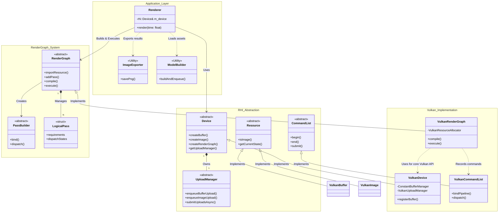

```mermaid
classDiagram
    namespace Application_Layer {
        class Renderer {
            -rhi::Device& m_device
            +render(time: float)
        }
        class ImageExporter {
            <<Utility>>
            +savePng()
        }
        class ModelBuilder {
            <<Utility>>
            +buildAndEnqueue()
        }
    }

    namespace RenderGraph_System {
        class RenderGraph {
            <<abstract>>
            +importResource()
            +addPass()
            +compile()
            +execute()
        }
        class PassBuilder {
            <<abstract>>
            +bind()
            +dispatch()
        }
        class LogicalPass {
            <<struct>>
            +requirements
            +dispatchStates
        }
    }

    namespace RHI_Abstraction {
        class Device {
            <<abstract>>
            +createBuffer()
            +createImage()
            +createRenderGraph()
            +getUploadManager()
        }
        class CommandList {
            <<abstract>>
            +begin()
            +end()
            +submit()
        }
        class UploadManager {
            <<abstract>>
            +enqueueBufferUpload()
            +enqueueImageUpload()
            +submitUploadsAsync()
        }
        class Resource {
            <<abstract>>
            +isImage()
            +getCurrentState()
        }
    }

    namespace Vulkan_Implementation {
        class VulkanDevice {
            -ConstantBufferManager
            -VulkanUploadManager
            +registerBuffer()
        }
        class VulkanRenderGraph {
            -VulkanResourceAllocator
            +compile()
            +execute()
        }
        class VulkanCommandList {
            +bindPipeline()
            +dispatch()
        }
    }

    %% Relationships
    Renderer --> Device : Uses
    Renderer --> RenderGraph : Builds & Executes
    Renderer ..> ImageExporter : Exports results
    Renderer ..> ModelBuilder : Loads assets

    Device <|-- VulkanDevice : Implements
    RenderGraph <|-- VulkanRenderGraph : Implements
    CommandList <|-- VulkanCommandList : Implements
    Resource <|-- VulkanBuffer : Implements
    Resource <|-- VulkanImage : Implements

    Device "1" *-- "1" UploadManager : Owns
    RenderGraph "1" *-- "N" LogicalPass : Manages
    RenderGraph --> PassBuilder : Creates

    VulkanRenderGraph ..> VulkanCommandList : Records commands
    VulkanRenderGraph ..> VulkanDevice : Uses for core Vulkan API
```