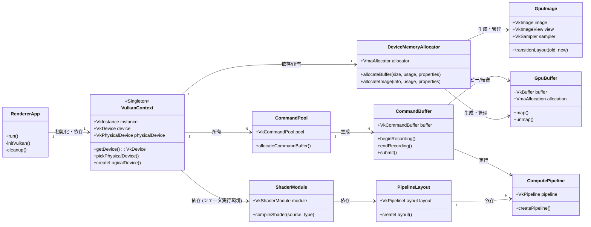
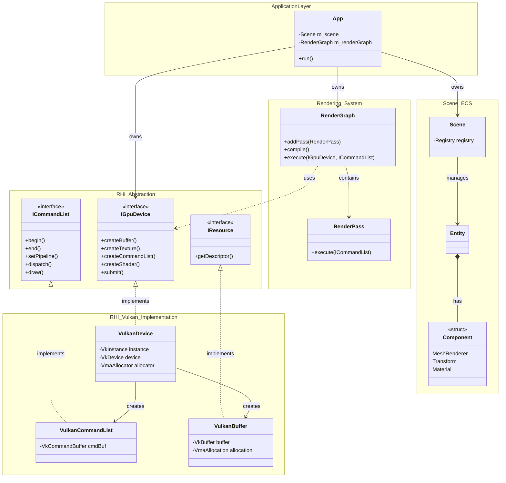
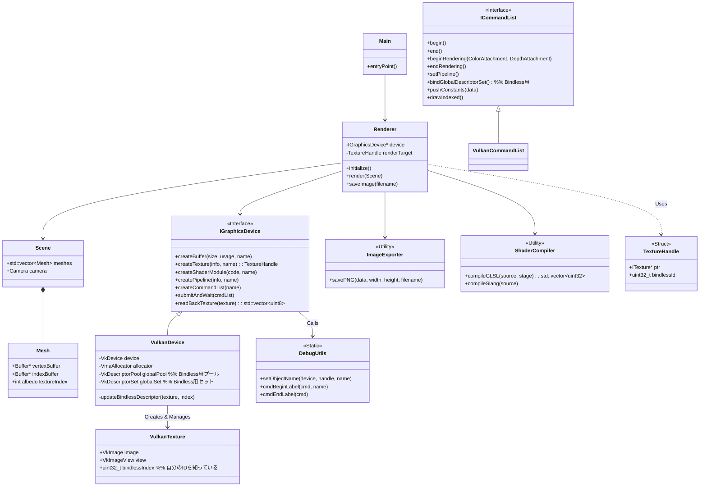

設計案

```mermaid
classDiagram
    direction LR

    class RendererApp {
        +run()
        -initVulkan()
        -cleanup()
    }
    
    class VulkanContext {
        <<Singleton>>
        +VkInstance instance
        +VkDevice device
        +VkPhysicalDevice physicalDevice
        +getDevice(): VkDevice
        +pickPhysicalDevice()
        +createLogicalDevice()
    }

    class DeviceMemoryAllocator {
        +VmaAllocator allocator
        +allocateBuffer(size, usage, properties)
        +allocateImage(info, usage, properties)
    }

    class GpuBuffer {
        +VkBuffer buffer
        +VmaAllocation allocation
        +map()
        +unmap()
    }

    class GpuImage {
        +VkImage image
        +VkImageView view
        +VkSampler sampler
        +transitionLayout(old, new)
    }

    class CommandPool {
        +VkCommandPool pool
        +allocateCommandBuffer()
    }

    class CommandBuffer {
        +VkCommandBuffer buffer
        +beginRecording()
        +endRecording()
        +submit()
    }

    class ShaderModule {
        +VkShaderModule module
        +compileShader(source, type)
    }

    class PipelineLayout {
        +VkPipelineLayout layout
        +createLayout()
    }
    
    class ComputePipeline {
        +VkPipeline pipeline
        +createPipeline()
    }

    RendererApp "1" --> "1" VulkanContext : 初期化・依存
    VulkanContext "1" --> "1" DeviceMemoryAllocator : 依存/所有
    DeviceMemoryAllocator --> GpuBuffer : 生成・管理
    DeviceMemoryAllocator --> GpuImage : 生成・管理
    VulkanContext "1" --> "N" CommandPool : 所有
    CommandPool "1" --> "N" CommandBuffer : 生成
    VulkanContext --> ShaderModule : 依存 (シェーダ実行環境)
    ShaderModule --> PipelineLayout : 依存
    PipelineLayout "1" --> "N" ComputePipeline : 依存
    CommandBuffer --> ComputePipeline : 実行
    CommandBuffer --> GpuBuffer : コピー/転送

```

---------------

```mermaid
classDiagram
    namespace ApplicationLayer {
        class App {
            +run()
            -Scene m_scene
            -RenderGraph m_renderGraph
        }
    }

    namespace RHI_Abstraction {
        %% Graphics APIの抽象化インターフェース
        class IGpuDevice {
            <<interface>>
            +createBuffer()
            +createTexture()
            +createCommandList()
            +createShader()
            +submit()
        }
        
        class ICommandList {
            <<interface>>
            +begin()
            +end()
            +setPipeline()
            +dispatch()
            +draw()
        }
        
        class IResource {
            <<interface>>
            +getDescriptor()
        }
    }

    namespace RHI_Vulkan_Implementation {
        %% Vulkan固有の実装
        class VulkanDevice {
            -VkInstance instance
            -VkDevice device
            -VmaAllocator allocator
        }
        
        class VulkanCommandList {
            -VkCommandBuffer cmdBuf
        }
        
        class VulkanBuffer {
            -VkBuffer buffer
            -VmaAllocation allocation
        }
    }

    namespace Scene_ECS {
        %% ECSとシーン管理
        class Scene {
            -Registry registry
        }
        class Entity
        class Component {
            <<struct>>
            MeshRenderer
            Transform
            Material
        }
    }

    namespace Rendering_System {
        %% レンダーグラフとパス管理
        class RenderGraph {
            +addPass(RenderPass)
            +compile()
            +execute(IGpuDevice, ICommandList)
        }
        
        class RenderPass {
            +execute(ICommandList)
        }
    }

    %% Relationships
    App --> IGpuDevice : owns
    App --> Scene : owns
    App --> RenderGraph : owns

    IGpuDevice <|.. VulkanDevice : implements
    ICommandList <|.. VulkanCommandList : implements
    IResource <|.. VulkanBuffer : implements

    VulkanDevice --> VulkanCommandList : creates
    VulkanDevice --> VulkanBuffer : creates

    RenderGraph --> RenderPass : contains
    RenderGraph ..> IGpuDevice : uses
    
    Scene --> Entity : manages
    Entity *-- Component : has
```

```mermaid
classDiagram
    %% --- Utility & Debug ---
    class DebugUtils {
        <<Static>>
        +setObjectName(device, handle, name)
        +cmdBeginLabel(cmd, name)
        +cmdEndLabel(cmd)
    }

    class ImageExporter {
        <<Utility>>
        +savePNG(data, width, height, filename)
    }

    class ShaderCompiler {
        <<Utility>>
        +compileGLSL(source, stage) : std::vector~uint32~
        +compileSlang(source)
    }

    %% --- Main Flow ---
    class Main {
        +entryPoint()
    }

    class Renderer {
        -IGraphicsDevice* device
        -TextureHandle renderTarget
        +initialize()
        +render(Scene)
        +saveImage(filename)
    }

    %% --- Data ---
    class Scene {
        +std::vector~Mesh~ meshes
        +Camera camera
    }
    
    class Mesh {
        +Buffer* vertexBuffer
        +Buffer* indexBuffer
        +int albedoTextureIndex  
        %% Bindless用のIndexを持つ
    }

    %% --- RHI Interface ---
    class IGraphicsDevice {
        <<Interface>>
        +createBuffer(size, usage, name)
        +createTexture(info, name) : TextureHandle
        +createShaderModule(code, name)
        +createPipeline(info, name)
        
        +createCommandList(name)
        
        %% オフラインレンダリング用重要機能
        +submitAndWait(cmdList) 
        +readBackTexture(texture) : std::vector~uint8~
    }

    class ICommandList {
        <<Interface>>
        +begin()
        +end()
        %% Dynamic Rendering: テクスチャを直接指定して開始
        +beginRendering(ColorAttachment, DepthAttachment) 
        +endRendering()
        
        +setPipeline()
        +bindGlobalDescriptorSet() %% Bindless用
        +pushConstants(data)
        +drawIndexed()
    }

    %% --- Vulkan Implementation ---
    class VulkanDevice {
        -VkDevice device
        -VmaAllocator allocator
        -VkDescriptorPool globalPool %% Bindless用プール
        -VkDescriptorSet globalSet   %% Bindless用セット
        
        -updateBindlessDescriptor(texture, index)
    }

    class VulkanTexture {
        +VkImage image
        +VkImageView view
        +uint32_t bindlessIndex %% 自分のIDを知っている
    }

    class TextureHandle {
        <<Struct>>
        +ITexture* ptr
        +uint32_t bindlessId
    }

    %% --- Relationships ---
    Main --> Renderer
    Renderer --> Scene
    Renderer --> IGraphicsDevice
    Renderer --> ImageExporter
    Renderer --> ShaderCompiler

    IGraphicsDevice <|-- VulkanDevice
    ICommandList <|-- VulkanCommandList
    
    IGraphicsDevice --> DebugUtils : Calls
    VulkanDevice --> VulkanTexture : Creates & Manages
    Renderer ..> TextureHandle : Uses
    Scene *-- Mesh
```